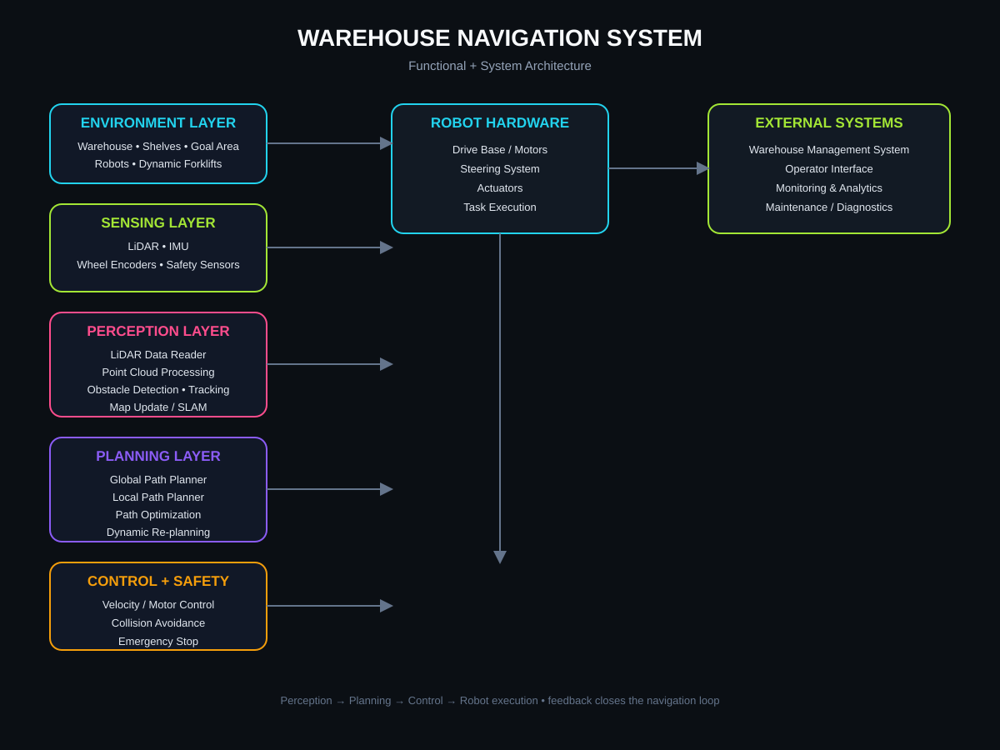
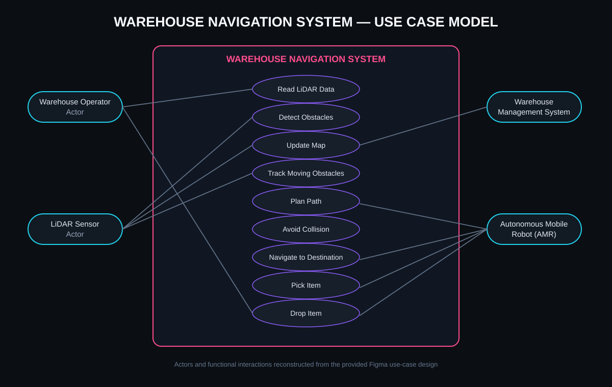

# WAREHOUSE AGV NAVIGATION SIMULATION

### Autonomous Mobile Robot Navigation • Product Design • System Architecture • Simulation


> A warehouse navigation case study combining **use-case analysis, PRD-driven product thinking, functional/system architecture, and AGV navigation simulation**.

---

## Overview

This project explores how an **Autonomous Guided Vehicle (AGV) / Autonomous Mobile Robot (AMR)** can navigate a warehouse environment while responding to static and dynamic obstacles.

The work connects product definition with robotics system design:

**Use Cases → Requirements → Functional Design → System Architecture → Navigation Workflow → Simulation**

The project was developed in the context of warehouse automation work at **JKW Innovatics**. The repository documents the design and simulation work available for this case study; it does not claim a production warehouse deployment.

---

## What I Worked On

| Area | Contribution |
|---|---|
| Product thinking | Translated warehouse-navigation needs into structured use cases and requirements |
| PRD | Defined product scope, functional requirements, workflows and expected system behaviour |
| Figma | Created combined functional and system architecture designs |
| Navigation | Modelled path planning, obstacle detection, moving-obstacle handling and collision avoidance concepts |
| Simulation | Built a Python/Pygame warehouse navigation simulation with static shelves and dynamic forklifts |
| Planning | Structured development into Agile sprint-oriented work |

---

## System at a Glance



The architecture separates the system into six major layers:

1. **Environment Layer** — warehouse layout, shelves, robots, goal areas and forklifts
2. **Sensing Layer** — LiDAR, IMU, wheel encoders and safety sensors
3. **Perception Layer** — sensor processing, obstacle detection, tracking and map updates
4. **Planning Layer** — global/local planning, path optimization and dynamic re-planning
5. **Control & Safety Layer** — velocity control, collision avoidance and emergency stop
6. **Robot Layer** — drive base, steering, actuators and task execution

---

## Use-Case Model



### Primary actors

- **Warehouse Operator** — supervises and interacts with navigation tasks
- **LiDAR Sensor** — provides environmental sensing data
- **Warehouse Management System** — provides warehouse-level tasks/context
- **Autonomous Mobile Robot (AMR)** — executes navigation and material-handling actions

### Core use cases

- Read LiDAR Data
- Detect Obstacles
- Update Map
- Track Moving Obstacles
- Plan Path
- Avoid Collision
- Navigate to Destination
- Pick Item
- Drop Item
- Assign Task

---

## Functional + System Architecture

The Figma design maps functional behaviour to system components rather than treating navigation as a single algorithm.

### Functional view

| Layer | Responsibility |
|---|---|
| Environment | Represents warehouse space, shelves, robots, goals and forklifts |
| Sensing | Captures environmental and robot-state data |
| Perception | Converts sensor data into usable environmental understanding |
| Planning | Produces efficient paths and adapts them when conditions change |
| Control & Safety | Converts plans into safe motion decisions |
| Robot | Executes movement and warehouse tasks |

### System view

```text
Sensors
   ↓
Perception
   ↓
Planning
   ↓
Control + Safety
   ↓
Robot Hardware
   ↓
Warehouse Task Execution
   ↺
Telemetry / State Feedback
```

---

## Navigation Workflow

```text
Warehouse Task
      ↓
Task Assignment
      ↓
Read Sensor Data
      ↓
Perceive Environment
      ↓
Detect / Track Obstacles
      ↓
Build or Update Map
      ↓
Generate Global Path
      ↓
Generate Local Path
      ↓
Check Collision Risk
      ↓
Execute Motion
      ↓
Dynamic Re-planning when required
      ↓
Reach Destination / Execute Task
```

The key design idea is that **planning and control are separate responsibilities**: the planner determines where the robot should go, while control and safety determine how motion is executed safely.

---

## Simulation Environment

The simulation models a warehouse navigation scenario with:

- Static warehouse shelves / obstacles
- A moving AGV/robot
- Dynamic forklifts / moving obstacles
- Destination/task locations
- Navigation and obstacle-handling behaviour

### Technology context

- **Python** — simulation and navigation logic
- **Pygame** — 2D warehouse simulation/visualisation
- **VS Code** — development environment
- **Figma** — functional and system architecture design

> The original implementation files are not currently included in this repository because the source project files are not available in the current workspace. The repository therefore documents the verified design and project scope without fabricating implementation code.

---

## Product Requirements Perspective

The project can be viewed as a small robotics product lifecycle:

### Problem
Warehouse robots need to move through constrained environments while responding to shelves, forklifts and other obstacles.

### Users / stakeholders

- Warehouse operators
- Warehouse management systems
- Robotics/system engineers
- Operations and maintenance teams

### Core product capabilities

- Receive or assign navigation tasks
- Sense the environment
- Detect static and moving obstacles
- Maintain an environmental representation
- Plan efficient routes
- Re-plan when the environment changes
- Avoid collisions
- Execute pick/drop/navigation tasks
- Provide observable system state

---

## Design Decisions

### 1. Perception is separated from planning
Raw sensor data should not directly drive high-level navigation decisions. Perception creates an intermediate representation that planning can consume.

### 2. Global and local planning have different responsibilities
Global planning provides route-level direction, while local planning reacts to nearby obstacles and changing conditions.

### 3. Dynamic obstacles require re-planning
A forklift can invalidate a previously safe route. The architecture therefore includes tracking and dynamic re-planning rather than assuming a static warehouse.

### 4. Safety is a cross-cutting concern
Collision avoidance and emergency-stop behaviour sit between planning and physical execution rather than being treated as an afterthought.

### 5. Product requirements drive technical decomposition
The architecture is derived from the functional behaviour represented in the use cases and design artifacts.

---

## Figma Design Artifact

The original design work was created in Figma as a combined **functional + system architecture** and use-case model.

**Figma:** [Combined Functional + System Architecture](https://www.figma.com/design/9vPEG6SwTsdlgqlLfvWyWL/combined-functional---system-architecture)

The repository includes reconstructed vector diagrams based on the provided design screenshots so the architecture remains visible directly on GitHub.

---

## Documentation

- [`docs/01-use-cases.md`](docs/01-use-cases.md) — actors, use cases and functional interactions
- [`docs/02-prd-and-requirements.md`](docs/02-prd-and-requirements.md) — product scope and requirements framework
- [`docs/03-functional-architecture.md`](docs/03-functional-architecture.md) — functional decomposition
- [`docs/04-system-architecture.md`](docs/04-system-architecture.md) — system components and boundaries
- [`docs/05-navigation-workflow.md`](docs/05-navigation-workflow.md) — end-to-end navigation flow
- [`docs/06-simulation.md`](docs/06-simulation.md) — simulation scope and scenarios
- [`docs/07-agile-planning.md`](docs/07-agile-planning.md) — sprint-oriented delivery structure

---

## Repository Scope

This repository is a **portfolio case study** of warehouse AGV navigation. It intentionally separates verified project work from future engineering extensions.

**Current documented work:** use cases, PRD/product framing, Figma functional/system architecture, navigation workflow and Python/Pygame simulation scope.

**Not claimed:** production fleet deployment, real robot control, safety certification, or a live warehouse integration.

---

## Future Engineering Extensions

If the original implementation is restored, this repository can be extended with:

- Grid-based or graph-based path planning
- A* global planning
- Local collision-avoidance logic
- Dynamic obstacle tracking
- Map representation and updates
- ROS-compatible node decomposition
- Automated navigation tests
- Simulation metrics such as path length, travel time and collision events

These are listed as **future extensions unless corresponding implementation files are added**.

---

## Author

**Saanvi Watrana**  
B.Tech Computer Science / Data Science

[GitHub](https://github.com/SaanviWatrana) · [Portfolio](https://saanviportfoliowebsite.vercel.app/)

---

<div align="center">

**WAREHOUSE NAVIGATION • ROBOTICS • PRODUCT DESIGN • SYSTEM ARCHITECTURE**

</div>
